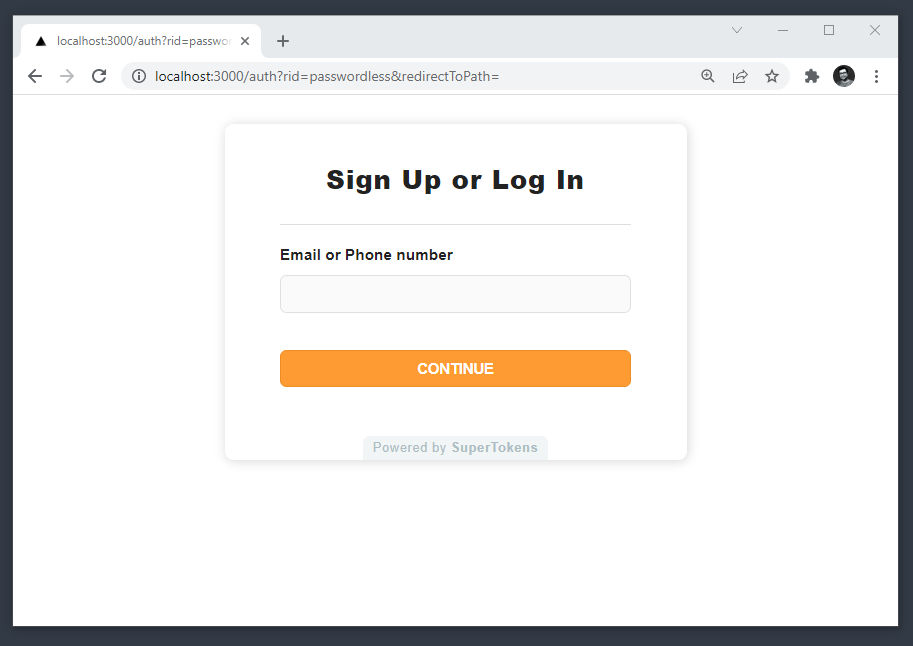
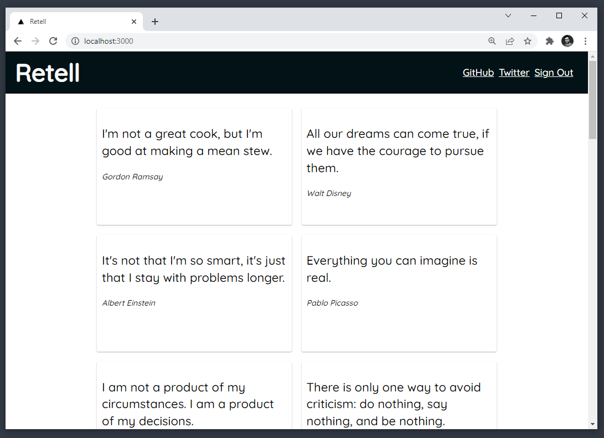

# Retell

`Retell` is an app to get you famous quotes from famous people around the world. This app is created to demonstrate the integration of `SuperTokens` Authentication with `Nextjs`. 

We use the `Passwordless` recipe of SuperTokens to fetch quotes in a guarded way and show them in a `Nextjs` component.

## Screenshots

The Login Screen:

<p align="center">
  
</p>

The Quotes Screen:

<p align="center">
  
</p>  

Liked it? Please support the project with a STAR(⭐).

## Getting Started
First, you need to install dependencies for `Retell`:

```bash
npm install

# or

yarn
```

Then, run the development server:

```bash
npm run dev
# or
yarn dev
```

Open [http://localhost:3000](http://localhost:3000) with your browser to see the result.

## Learn More

To learn more about Next.js, take a look at the following resources:
- [SuperTokens Documentation](https://supertokens.com/docs/community/introduction) - The documentation for SuperTokens
- [Next.js Documentation](https://nextjs.org/docs) - learn about Next.js features and API.
- [Learn Next.js](https://nextjs.org/learn) - an interactive Next.js tutorial.

You can check out the repository - your feedback and contributions are welcome!

